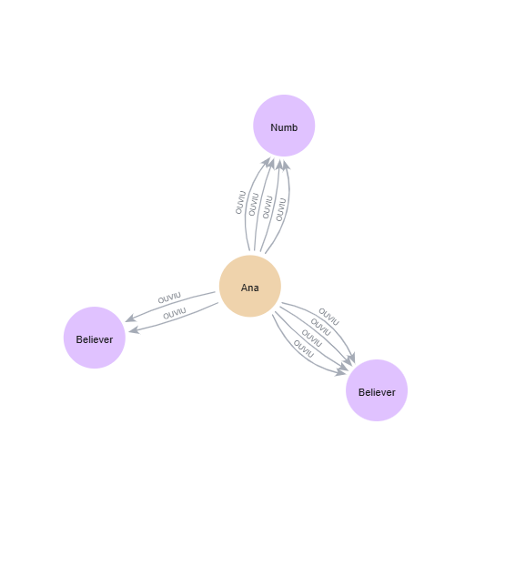

# neo4j-recomendacao-musicas
# Sistema de Recomendação de Músicas com Neo4j

Banco de dados com mais de **76 mil músicas** utilizado para simular um **sistema de recomendação baseado em grafos**.

## Objetivo

Este projeto demonstra como bancos de dados em grafos podem ser utilizados para construir sistemas de recomendação musical. Utilizando o **Neo4j** e a linguagem **Cypher**, o modelo conecta usuários, músicas, artistas e gêneros para permitir análises de comportamento e geração de recomendações.

Dataset utilizado:
- 76.059 músicas
- 23 usuários
- 16 gêneros musicais

## Modelagem do Grafo

O sistema utiliza os seguintes tipos de nós:

* **Usuario**
* **Musica**
* **Artista**
* **Genero**

## Modelo do Grafo

Modelo do grafo:
```cypher
Usuario -[:OUVIU]-> Musica
Musica -[:PERFORMED_BY]-> Artista
Musica -[:IN_GENRE]-> Genero
```


Relacionamentos principais:

* `(Usuario)-[:OUVIU]->(Musica)`
* `(Musica)-[:PERFORMED_BY]->(Artista)`
* `(Musica)-[:IN_GENRE]->(Genero)`

## Dataset

O banco contém aproximadamente:

* **76.059 músicas**
* **23 usuários**
* **16 gêneros musicais**

Esses dados permitem simular padrões de escuta e testar algoritmos de recomendação.

## Exemplos de Consultas

### Recomendação de músicas

```cypher
MATCH (u:Usuario {nome:"Ana"})-[:OUVIU]->(m:Musica)<-[:OUVIU]-(outro:Usuario)
MATCH (outro)-[:OUVIU]->(rec:Musica)
WHERE NOT (u)-[:OUVIU]->(rec)
RETURN rec.titulo AS Musica_Recomendada, count(*) AS Score
ORDER BY Score DESC
LIMIT 10
```

### Usuários com gosto musical semelhante

```cypher
MATCH (u1:Usuario)-[:OUVIU]->(m:Musica)<-[:OUVIU]-(u2:Usuario)
WHERE id(u1) < id(u2)
RETURN u1.nome AS Usuario1,
       u2.nome AS Usuario2,
       count(m) AS Musicas_em_Comum
ORDER BY Musicas_em_Comum DESC
```

## Tecnologias Utilizadas

* Neo4j
* Cypher
* Modelagem de Grafos


## Dificuldades Encontradas

Durante o desenvolvimento foram encontrados alguns desafios:

* Duplicidade de usuários no grafo
* Conflito entre índices e constraints
* Labels duplicadas no banco (Musica / Música)

Esses problemas foram resolvidos utilizando comandos de limpeza de dados e criação de **constraints de unicidade**.

## Conclusão

Bancos de dados em grafos permitem identificar padrões de relacionamento entre usuários e músicas de forma eficiente, possibilitando sistemas de recomendação mais inteligentes e escaláveis.
